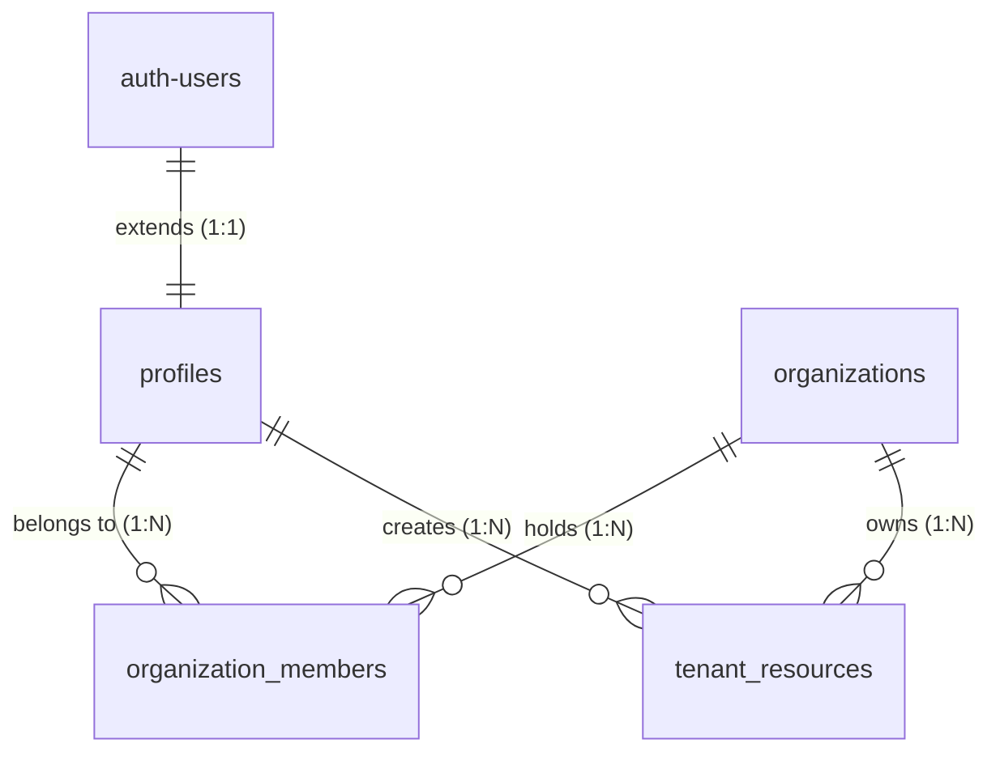

# Secure Multi-Tenant Auth Boilerplate (Next.js + Supabase RLS)

A production-grade, secure **Multi-Tenant Boilerplate** demonstrating strict user data isolation and Role-Based Access Control (RBAC). It leverages PostgreSQL **Row Level Security (RLS)** in Supabase and the Next.js App Router with Server-Side Rendering (SSR) cookie validation.

Designed with a premium **Cupertino OLED / Dark Tactical** aesthetic, it includes a multi-tenant onboarding flow (workspace creation and invite code enrollment), secure Server Actions (React 19 compatible), and a restricted administration console.

---

## Key Features

- **Zero-Trust Data Isolation (PostgreSQL RLS)**: All database tables enforce Row Level Security. Data isolation happens natively inside PostgreSQL, guaranteeing that a tenant can never view or modify resource logs belonging to another workspace.
- **Role-Based Access Control (RBAC)**: Supports roles (`owner`, `admin`, and `member`). Frontend inputs and backend Server Actions are guarded; standard members are restricted to read-only views, while owners/admins retain full management rights.
- **Next.js Server-Side Auth (`@supabase/ssr`)**: Utilizes Supabase's SSR utility to validate session JWTs in Next.js Server Components, Server Actions, and Route Middlewares using secure HTTP-only cookies. Optimized for Next.js 16's asynchronous cookie store.
- **Automatic Profile Synchronization**: A custom PL/pgSQL database trigger automatically generates a public profile record when a user signs up through Supabase Auth, mapping names and avatars seamlessly.
- **Dual Onboarding Flow**:
  - **Create Organization**: Launches a new workspace, generates a unique 8-character invitation key, and assigns the user as the `owner`.
  - **Join Workspace**: Connects users to an existing workspace using a shared invite code, assigning the `member` role.
- **Husky & formatting guardrails**: Pre-configured Prettier, ESLint, lint-staged, and pre-commit hooks.

---

## Database Architecture (Supabase SQL)

The system relies on 4 core tables:

1.  `profiles`: Extends Supabase's internal `auth.users` with metadata (name, email).
2.  `organizations`: Defines the tenant namespace, slug, and the unique `invite_code`.
3.  `organization_members`: Maps profiles to organizations and stores their RBAC roles.
4.  `tenant_resources`: Stores tenant-specific business data, protected by organization boundaries.



---

## Deep Technical Dive: RLS Policies in Action

Instead of filtering datasets by `organization_id` using JavaScript query parameters (which can be easily bypassed by changing URL params or APIs), this boilerplate enforces security directly in the database engine.

For example, our RLS policy protecting `tenant_resources` reads:

```sql
CREATE POLICY "Users can read resources of their organization" ON public.tenant_resources
    FOR SELECT USING (
        organization_id IN (
            SELECT org_id.organization_id FROM public.organization_members org_id
            WHERE org_id.profile_id = auth.uid()
        )
    );
```

When a user calls `select * from tenant_resources`, PostgreSQL evaluates this subquery. It maps the user's authenticated ID (`auth.uid()`) to their organization memberships. If the resource's `organization_id` is not in that list, the database filters it out.

Even if an attacker sends a raw SQL request to get data from another tenant, the database returns **0 rows**, preventing unauthorized leaks.

---

## Directory Structure

```text
├── app/
│   ├── dashboard/       # Protected Console Area
│   │   ├── members/     # Team members list and invite display
│   │   ├── actions.ts   # Server Actions (signOut, createResource)
│   │   └── layout.tsx   # Server Component layout fetching orgs/profiles
│   ├── login/           # Cupertino Sign-In & Sign-Up Interface
│   │   └── actions.ts   # Server Actions (login, signup)
│   ├── onboarding/      # Workspace creation & invite code entry
│   │   └── actions.ts   # Server Actions (createOrganization, joinOrganization)
│   └── page.tsx         # Root router redirecting to login/dashboard
├── components/
│   └── ResourceForm.tsx # Client-side form integrating with Server Actions
├── utils/
│   └── supabase/        # Supabase Client SSR Initializations
│       ├── client.ts    # Browser client wrapper
│       ├── middleware.ts# Session refreshes & route redirects logic
│       └── server.ts    # Server component cookie client (Next 16 ready)
├── schema.sql           # Database schema, triggers & RLS scripts
├── middleware.ts        # Next.js route interceptor
└── package.json         # Scripts, ports (5178), and Husky configurations
```

---

## Getting Started

### 1. Setup Supabase Project

1.  Create a new project on [Supabase](https://supabase.com/).
2.  Navigate to the **SQL Editor** on the left menu.
3.  Click **New Query**, paste the entire contents of [schema.sql](schema.sql), and click **Run**. This will create the database tables, triggers, and all RLS security policies.

### 2. Installation & Setup

Clone the repository and install the dependencies:

```bash
git clone <your-repository-url>
cd secure-multi-tenant-auth-boilerplate
npm install
```

Configure your environment variables by creating a `.env.local` file in the root:

```env
NEXT_PUBLIC_SUPABASE_URL=https://your-project-ref.supabase.co
NEXT_PUBLIC_SUPABASE_ANON_KEY=your-supabase-anon-key
```

### 3. Run Development Server

Run the development server. It runs on port **`5178`** by default to prevent conflicts:

```bash
npm run dev
```

Open [http://localhost:5178](http://localhost:5178) in your browser.

---

## Testing Tenant Isolation

To verify RLS is working correctly:

1.  Open two different browser windows (e.g., standard and incognito).
2.  Register **User A** in Window A and create **Organization Alpha**. Insert a resource (e.g., "Alpha database").
3.  Register **User B** in Window B and create **Organization Beta**. Insert a resource (e.g., "Beta servers").
4.  **Confirm Isolation:** User A will only see Alpha resources; User B will only see Beta resources. The data is securely locked down inside Supabase.
5.  **Verify RBAC:** Invite User C into Organization Alpha using the invite code. Check that User C (assigned the `member` role by default) has read-only access and cannot write resources.
